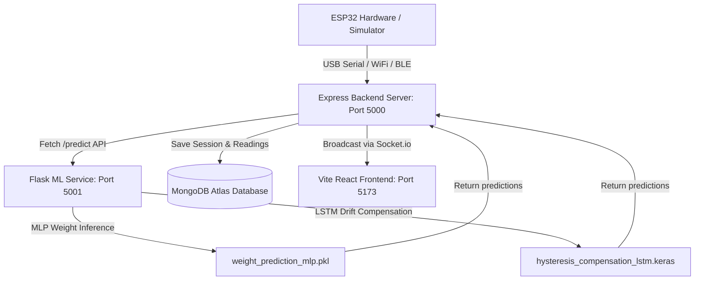

# Assistive Device for Varmam Therapy — Clinical Monitoring Suite

This clinical application is a healthcare-grade real-time dashboard developed for a capstone project. It allows practitioners to onboard patients, configure therapy protocols, link physical ESP32 sensor hardware (8×8 pressure grid), visualize pressure distributions, and run dual Machine Learning models in real time to perform weight prediction and sensor drift/hysteresis compensation.

---

## 📸 System Architecture

The clinical suite employs a modular, dual-server, full-stack architecture:



1. **Frontend (Vite / React / TypeScript / Tailwind CSS)**: Renders a premium, responsive multi-step wizard and live monitoring console. Integrates real-time Socket.io streams for interactive charts and heatmaps.
2. **Express Backend (Node.js)**: Orchestrates hardware connections (serial parser, network REST endpoints), connects to MongoDB Atlas for session persistence, manages simulation routines, and proxies sensor packets to the Flask ML Service.
3. **ML Service (Python Flask)**: A dedicated microservice that hosts the pre-trained neural networks. Handles features scaling and inference at high frequency.

---

## 📂 Folder Structure

```
varmam_dashboard_updated_output/
├── backend/
│   ├── models/                    # Model binary dumps and scalers
│   │   ├── hysteresis_compensation_lstm.keras   # LSTM model (drift compensation)
│   │   ├── weight_prediction_mlp.pkl            # MLP model (force/weight prediction)
│   │   ├── mlp_scaler.pkl                       # MinMaxScaler/StandardScaler for MLP
│   │   ├── hysteresis_scaler.pkl                # MinMaxScaler/StandardScaler for LSTM
│   │   ├── state_encoder_lstm.pkl               # Label encoder for LSTM
│   │   └── state_encoder_mlp.pkl                # Label encoder for MLP
│   ├── ml_service.py              # Flask ML inference web server (Port 5001)
│   ├── server.js                  # Express API & WebSocket server (Port 5000)
│   ├── package.json
│   └── package-lock.json
├── src/                           # React Frontend Source
│   ├── assets/                    # Graphical illustrations and styling
│   ├── components/                # Reusable UI controls and wrappers
│   ├── lib/                       # Global context, utils, and state providers
│   ├── routes/                    # Routing pages (Doctor, Patient, Therapy, Dashboard)
│   ├── routeTree.gen.ts           # TanStack router definitions
│   └── styles.css                 # Base theme and canvas meshes
├── package.json
├── tsconfig.json
├── vite.config.ts
└── README.md
```

---

## 🛠️ Installation Guide

### Prerequisites
- **Node.js**: v18+ (tested on v20.x/v22.x)
- **Python**: v3.10+ (tested on v3.13.x) with pip installed
- **Git** (optional)

### 1. Install Frontend Dependencies
From the root directory:
```bash
npm install
```

### 2. Install Express Backend Dependencies
From the `backend/` directory:
```bash
cd backend
npm install
```

### 3. Install Python ML Dependencies
Install the required packages globally or inside your Python virtual environment:
```bash
pip install flask flask-cors numpy pandas scikit-learn joblib tensorflow
```

---

## 🚀 Running the Application

For a fully operational system, you must start three components (preferably in separate terminal windows):

### Step 1: Start the Python ML Service
From the root directory:
```bash
python backend/ml_service.py
```
*Verify Console Output*:
```
Loading Machine Learning Models...
MLP Model loaded successfully
LSTM Model loaded successfully
 * Running on http://127.0.0.1:5001
```

### Step 2: Start the Express Backend Server
From the `backend/` directory:
```bash
cd backend
npm start
```
*Verify Console Output*:
```
✓ Node.js Server running on http://localhost:5000
✓ MongoDB Atlas Connected
```

### Step 3: Start the Vite Frontend Server
From the root directory:
```bash
npm run dev
```
Open your browser and navigate to **`http://localhost:5173/`**.

---

## 🔌 Hardware & Simulation Integration

The dashboard is designed to connect to the sensor grid dynamically:

1. **Live USB Cable**:
   - Navigate to the **Device Status** tab in the sidebar.
   - Click the **Refresh Ports** button to scan your local system COM ports.
   - Choose the COM port corresponding to your ESP32 (e.g., `COM5` or `/dev/ttyUSB0`) and click **Link COM Port**.
2. **Wireless WiFi/Bluetooth**:
   - Program the ESP32 to POST JSON sensor frames to the endpoints shown in the **Device Status** tab:
     - WiFi: `POST http://<server-ip>:5000/esp-data`
     - Bluetooth: `POST http://<server-ip>:5000/bluetooth-data`
3. **ESP32 Simulator**:
   - Go to the **Settings** tab and toggle **ESP32 Hardware Simulation**.
   - This starts a background generator emitting dynamic Gaussian pressure profiles simulating physical finger presses, which is fully processed by the ML models in real time.

---

## 🧠 Machine Learning Details

- **MLP Model (`weight_prediction_mlp.pkl`)**: Analyzes the active pressure distribution and calculates the applied load in grams (`weight_g`).
- **LSTM Model (`hysteresis_compensation_lstm.keras`)**: Uses a sliding sequence window of 6 sensor frames to compensate for polymer sensor drift (hysteresis) and outputs a highly accurate pressure value in Newtons (`target_force_N`).

---

## 🔍 Troubleshooting

- **Unicode Console Crash (Windows)**:
  - If you encounter a `UnicodeEncodeError` when running `ml_service.py` in the standard cmd/powershell, ensure your terminal is set to UTF-8 encoding by running `chcp 65001` before launching the script.
- **Port Conflicts**:
  - Ensure ports `5000` (Node), `5001` (Flask), and `5173` (Vite) are free. Use `netstat -ano | findstr <port>` on Windows to locate and kill blocking tasks.
- **MongoDB Database Write Failure**:
  - The Mongoose driver requires a network connection to MongoDB Atlas. Ensure your internet connection is active.
